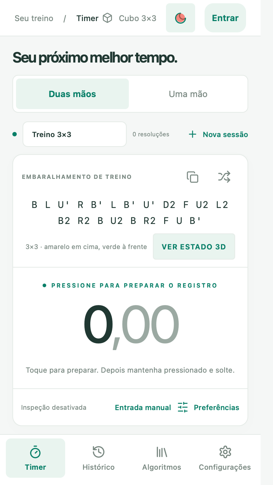
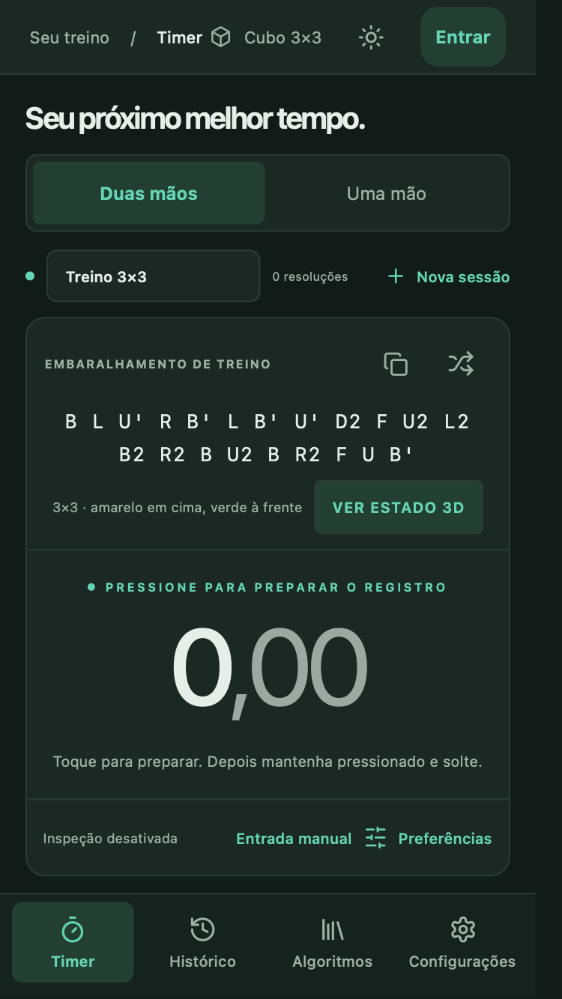
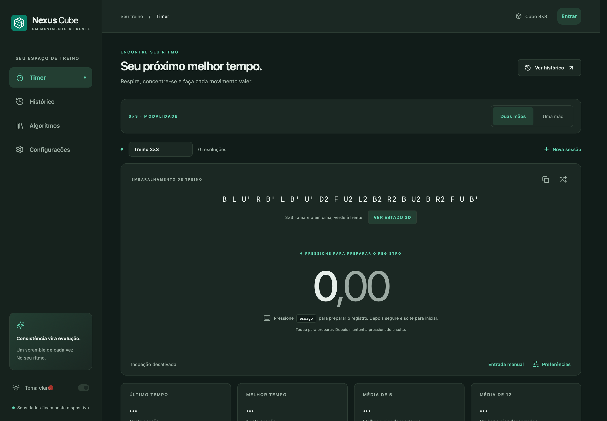
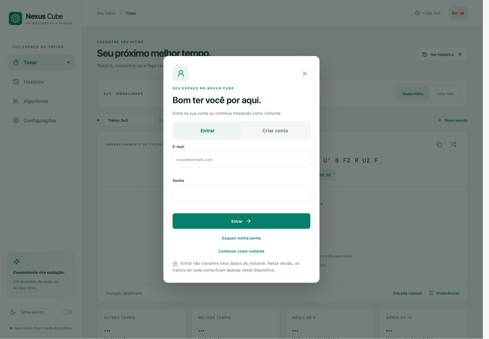
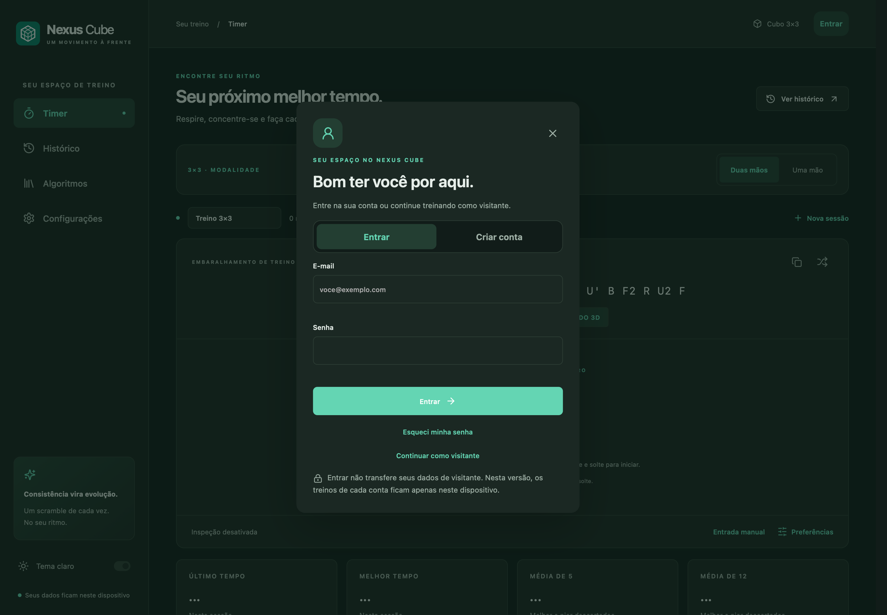
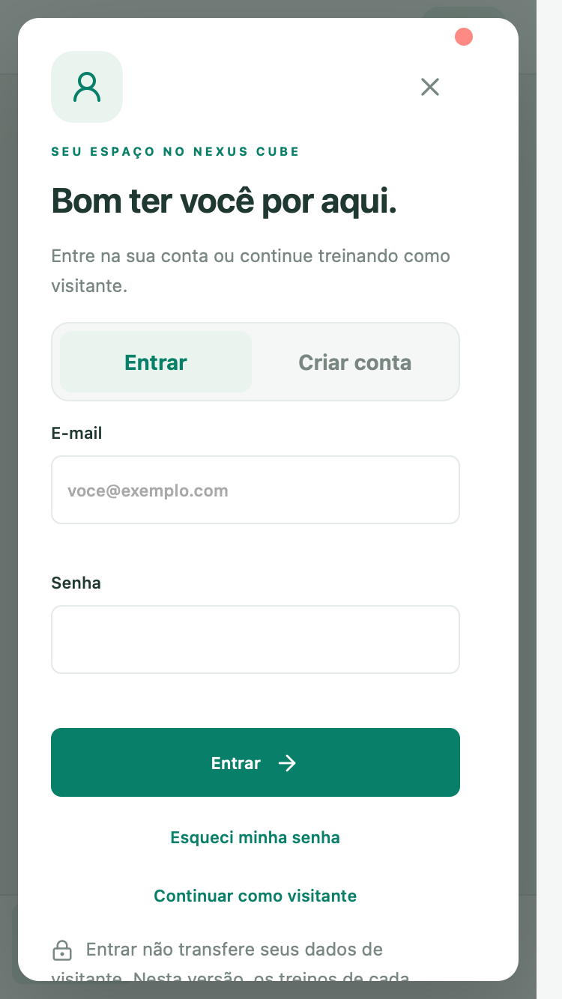
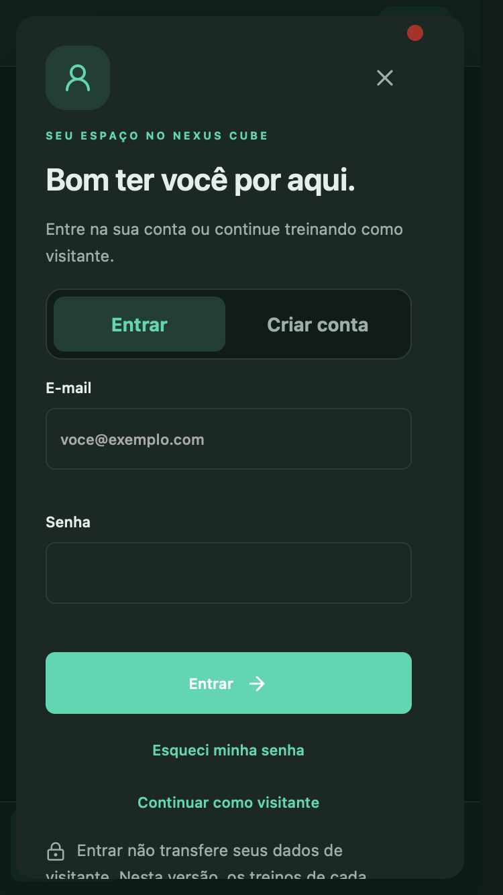
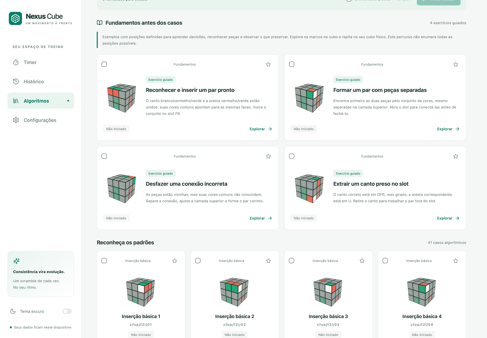
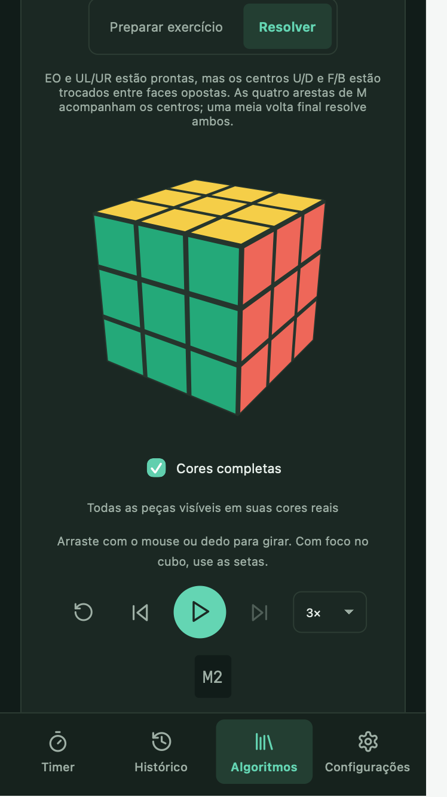

# Nexus Cube

Um espaço de treino de cubo 3×3 em React e TypeScript, em português brasileiro. Timer, histórico e biblioteca didática CFOP e Roux, com visualização 3D do estado real do cubo. Interface responsiva, temas claro e escuro, armazenamento local e PWA.

## Demonstração online

[Abrir Nexus Cube](https://nexus-cube-phi.vercel.app/)

Capturas reais de 8 de setembro de 2026, na demonstração pública. Timer de visitante com sessão local demonstrativa vazia, Duas mãos e scramble gerado pelo app; nenhum tempo ou dado pessoal foi preenchido. O formulário de entrada aparece com campos vazios, recapturado após o redeploy com configuração pública presente. O usuário relatou cadastro e conexão bem-sucedidos; a verificação desta documentação confirmou apenas a configuração do bundle e a interface pública, sem realizar login ou envio de email. Isso não comprova todos os fluxos de Auth, entrega SMTP ou sincronização.

Desktop 1440×1000, tema claro:


Mobile 375×667:

| Claro | Escuro |
| --- | --- |
|  |  |

<details>
<summary>Desktop escuro e formulário de entrada</summary>



Formulário vazio, desktop 1440×1000, após o redeploy com configuração pública presente. Nenhum submit realizado:

| Claro | Escuro |
| --- | --- |
|  |  |

Formulário vazio, mobile 375×667. O conteúdo do modal pode rolar:

| Claro | Escuro |
| --- | --- |
|  |  |

</details>

As imagens do Timer preservam a primeira coleta, entry `index-yZAwXSCH.js`, SHA256 `b3551c80452437787e42d6f81a620341ae74cb8c5916580bf622cc69772655ff`, que estava sem configuração de Auth. Os quatro formulários foram recapturados no novo entry `index-CdvfY9QR.js`, SHA256 `bcd4625147d77c0ebc4a207d7bec0aec5d9941a2060299c15606cbe60de92e43`, com URL e chave pública presentes e válidas para o projeto esperado. Esses hashes identificam os artefatos observados, sem presumir o commit do deployment. PNGs em escala 2×, sem edição de conteúdo; [dimensões, hashes e versão por imagem](docs/screenshots/capture-info.json).

## Biblioteca e cubo 3D

As quatro imagens abaixo são **capturas locais históricas** de 8 de setembro de 2026, anteriores ao acesso restrito por autenticação. Mostram conteúdo real do catálogo e não representam uma sessão autenticada na produção atual. Não contêm dados pessoais. A interface evoluiu desde a coleta; por exemplo, as referências técnicas do F2L passaram a usar rótulos mais legíveis.

CFOP, fundamentos F2L e início dos 41 casos, desktop claro (1440×1000):



PLL com setas de permutação e ajustes U explícitos, desktop escuro (1439×999):


PLL Z, alternativa selecionada, preparo copiável, cubo 3D e controles Preparar/Resolver, desktop escuro (1439×1200):


Roux LSE no celular, etapa final concluída e reprodução passo a passo, tema escuro (374×667):



PNGs originais em escala 2×, sem edição de conteúdo, total de 1.911.856 bytes nesta seleção. Os metadados EXIF presentes contêm somente informações técnicas de resolução, dimensões e espaço de cor. Proveniência, datas documentais e SHA256 de cada arquivo estão em [capture-info.json](docs/screenshots/capture-info.json).

## Rodar localmente

Use Node.js **22.3 ou superior**, conforme a dependência `cubing`, e npm. O desenvolvimento desta entrega foi verificado com Node.js 24.18.0.

```sh
npm ci
npm run dev
```

Abra [localhost:3000](http://localhost:3000). A porta é estrita: se estiver ocupada, preserve o processo existente e coordene outra porta. Sem login, somente o Timer está disponível. Histórico, biblioteca, estudo e configurações gerais exigem uma conta; preferências essenciais e instalação do PWA estão no Timer. Para habilitar autenticação, copie `.env.example` para `.env.local` e preencha `VITE_SUPABASE_URL` e `VITE_SUPABASE_PUBLISHABLE_KEY` com a configuração pública do seu projeto Supabase. Nunca use uma chave administrativa no frontend. O arquivo real de ambiente não deve ser versionado.

Configure o retorno dos e-mails de recuperação e de eventual confirmação em `/auth/callback` da origem utilizada, inclusive na URL HTTPS de produção. O fluxo PKCE precisa ser concluído no mesmo navegador em que foi iniciado.

## O que está disponível

- **Modalidades 3×3:** Duas mãos e Uma mão, com sessões, resoluções, médias, recordes e gráficos separados. Registros anteriores ficam visíveis como Não classificados até uma classificação explícita da sessão inteira.
- **Timer:** teclado e toque com um único gesto de retenção; a liberação inicia somente após o limiar e a captura durável, enquanto uma liberação precoce cancela sem início tardio. Inclui inspeção opcional de 15 segundos, avisos aos 8/12 segundos, entrada manual, notas, penalidades +2/DNF e associação do scramble ao registro. O tempo bruto é preservado.
- **Histórico:** sessões, exclusão com desfazer, estatísticas por sessão e globais, gráfico, médias ao5/12/50/100, CSV e backup JSON validado.
- **CFOP:** quatro exercícios de cruz, quatro fundamentos F2L e **41 casos F2L**, **57 OLL** e **21 PLL**. OLL e PLL incluem seleções introdutórias em duas etapas.
- **Roux:** quatro exercícios de primeiro bloco, quatro de segundo bloco, **42 CMLL** e oito exercícios LSE, cobrindo normalização dos centros, orientação das seis arestas, UL/UR e conclusão das arestas e centros.
- **Estudo:** seleção, sorteio, preparo para cubo físico, solução oculta até revelar, autoavaliação e tempo opcional. Os registros de estudo não entram nas estatísticas de solves.
- **Cubo 3D:** câmera por arrasto de mouse/pointer e setas, foco nas peças estudadas, cores completas opcionais, reprodução com pausa, passos, velocidade e notação sincronizada. Marcos dos exercícios explicam posições reais. Os 21 PLL mostram diagramas convencionais de permutação com ajuste U explícito quando necessário e acesso à sequência original.

São **161 casos algorítmicos e 24 exercícios guiados**. Os exercícios são exemplos finitos de progressão, não uma enumeração de todas as construções intuitivas de cruz/blocos ou posições LSE. Os fundamentos e casos F2L usam o slot frontal direito. A [curadoria](docs/expansion-curation/README.md) registra os recortes, as referências, os grupos e as provas reproduzíveis.

Em casos algorítmicos, **Preparar o caso** é a inversa da solução exibida. Nos PLL, o padrão alinhado pode acrescentar um ajuste U ao preparo e sua compensação à solução; ambos ficam explícitos. A opção **Sequência original** usa a alternativa sem esse alinhamento adicional. Em exercícios com solução parcial, **Preparar exercício** monta o contexto autoral; **Reverso da solução** desfaz somente essa solução. Trocar alternativa ou modo reinicia o playback.

## Dados e backup

Tudo fica no navegador e na origem em que o app foi aberto. `localhost` e `127.0.0.1` têm armazenamentos distintos. Neste checkpoint, a sincronização automática está explicitamente desabilitada (`syncEnabled: false`). Exporte backups em Configurações antes de trocar dispositivo ou limpar dados do navegador.

O formato ativo/exportado é v3. A leitura de v1/v2 preserva sessões, solves, preferências, progresso e estudo, acrescentando modalidade não classificada aos registros anteriores. Não se presume Duas mãos. Classificar exige confirmar que a sessão inteira pertence à modalidade; sessões misturadas ou incertas podem permanecer não classificadas. No primeiro uso de um espaço visitante comprovadamente novo, o repositório cria **Treino diário**, em **Duas mãos**, com acesso ao seletor Uma mão. Sessões existentes, modalidade não classificada e dados corrompidos não acionam esse padrão; excluir a última sessão não o recria. Outras novas sessões exigem modalidade explícita. Em contas, a criação automática aguarda hidratação remota e permanece pendente com sync OFF. A fonte original `nexus-cube:v1` é preservada. O repositório de autenticação usa IndexedDB e separa os dados de visitante dos espaços locais de cada identidade; entrar em uma conta não adota nem envia os registros de visitante. A versão do conteúdo é validada separadamente. Importações são validadas antes da gravação. Dados corrompidos e falhas de armazenamento são apresentados ao usuário.

## Verificar e gerar produção

Verificação estática e exemplo de teste focado:

```sh
npm run typecheck
node --import tsx --test tests/domain/expansion-content.test.ts
```

Com o repositório estável e um único consumidor de integração:

```sh
node --import tsx --test \
  tests/cloud/auth-errors.test.ts \
  tests/cloud/capture.test.ts \
  tests/cloud/first-use.test.ts \
  tests/cloud/sync-gate.test.ts \
  tests/domain/backup-byte-budget.test.ts \
  tests/domain/cube-catalog.test.ts \
  tests/domain/default-training.test.ts \
  tests/domain/expansion-content.test.ts \
  tests/domain/expansion-f2l.test.ts \
  tests/domain/expansion-storage.test.ts \
  tests/domain/imports/parsers.test.ts \
  tests/domain/metadata-playback.test.ts \
  tests/domain/modes.test.ts \
  tests/domain/pll-permutation.test.ts \
  tests/domain/pll-recognition.test.ts \
  tests/domain/scramble.test.ts \
  tests/domain/statistics-data.test.ts \
  tests/domain/sync-projection.test.ts \
  tests/qa/auth-core-contract.test.ts \
  tests/qa/backup-v1-v2-migration.test.ts \
  tests/qa/backup-v2-contract.test.ts \
  tests/qa/catalog-contract.test.ts \
  tests/qa/cmll-cpco-oracle.test.ts \
  tests/qa/exercises-kpuzzle-oracle.test.ts \
  tests/qa/exercises-stage-oracle.test.ts \
  tests/qa/expansion-corpus-fixtures.test.ts \
  tests/qa/first-use-training-contract.test.ts \
  tests/qa/fixture-integrity.test.mjs \
  tests/qa/modes-contract.test.ts \
  tests/qa/persistence-contract.test.ts \
  tests/qa/playback-contract-fixtures.test.ts \
  tests/qa/pll-endpoint-oracle.test.ts \
  tests/qa/pll-recognition-oracle.test.ts \
  tests/qa/statistics-contract.test.ts \
  tests/qa/sync-projection-contract.test.ts \
  tests/qa/timer-auth-quota-focused.test.ts \
  tests/qa/user-visual-reference.test.ts \
  tests/security/auth-autoevent.test.ts \
  tests/security/auth-isolation.test.ts \
  tests/security/first-use-capture-boundary.test.ts \
  tests/security/service-worker-boundary.test.ts \
  tests/security/supabase-adapter-boundary.test.ts \
  tests/security/sync-byte-budget.test.ts \
  tests/security/sync-codec.test.ts \
  tests/security/sync-engine-adversarial.test.ts \
  tests/security/sync-input-preservation.test.ts \
  tests/security/sync-projection-boundary.test.ts
node --import tsx --test --test-name-pattern='OFF keeps' tests/security/sync-gate-boundary.test.ts
npm run build
```

Em um workspace compartilhado, combine a pausa dos escritores e a janela de integração antes da suíte completa ou build. Este manifesto é o recorte de integração UX com sincronização OFF: 47 arquivos, 221 testes aprovados, mais dois testes aprovados no comando separado filtrado por `OFF keeps`. Execute cada comando seguinte somente se o anterior terminar com exit 0. Os cenários ON excluídos pelo filtro, incluindo um cenário com falha conhecida, não são declarados aprovados; o arquivo original permanece preservado. SQL, backend de sync ON e o baseline arquivado em `tests/qa/fixtures-v1-baseline/` ficam fora deste recorte. Não substitua a lista por um glob de todos os testes. Os testes usam fixtures sintéticas e oráculos independentes; não são dados iniciais do aplicativo. Consulte [os testes de QA](tests/qa/README.md).

O build produz `dist/`. Para experimentar o build, `npm run preview` usa a porta 3001. Se ela estiver ocupada, escolha uma porta livre explicitamente, por exemplo:

```sh
npx vite preview --host 127.0.0.1 --port 4173 --strictPort
```

Não inicie outro servidor na porta de um processo existente. Preview é uma ferramenta local de verificação; a hospedagem pode servir os arquivos estáticos de `dist/` com HTTPS.

## PWA e offline

O service worker é registrado apenas no build de produção. Após a primeira carga completa, o precache inclui os arquivos gerados, os chunks de workers/solver, ícones, avisos de terceiros e fontes locais da curadoria. Nenhum CDN é necessário para o cubo, catálogo ou gerador de estados aleatórios. Auth, API e callbacks de autenticação são excluídos da interceptação do service worker. Cadastro, entrada, confirmação e recuperação de senha precisam de rede; a retomada offline de uma conta previamente estabelecida exige escolha explícita.

Para verificar offline, abra a produção, espere a instalação do service worker, recarregue e confira novas consultas ao catálogo e novos scrambles com a origem indisponível. A instalação depende do navegador; no iOS, use Compartilhar e Adicionar à Tela de Início.

## Fontes, atribuições e estado de validação

- Scrambles de estados aleatórios: `cubing` 0.63.4, opção MPL-2.0 e avisos de terceiros preservados, incluindo min2phase MIT. São embaralhamentos de treino, sem alegação de homologação WCA.
- Autenticação: `@supabase/supabase-js` 2.116.0 sob MIT. Os avisos das dependências transitivas, incluindo `tslib` sob 0BSD, estão no arquivo distribuído de notices.
- Catálogo base e F2L: dados Cube Coach de Luke Jackson sob MIT, com origem e adaptação documentadas.
- CMLL e exercícios: seleção, geração e explicações autorais, com sementes licenciadas e referências factuais de ensino. Não foram copiadas imagens ou coleções restritas de terceiros.
- [Fontes e licenças completas](docs/sources-and-licenses.md), [avisos distribuídos](public/third-party-notices.txt) e [curadoria](docs/expansion-curation/README.md).

O código original do Nexus Cube é distribuído sob a [licença MIT](LICENSE), copyright 2026 Nexus Cube contributors. Dependências e materiais de terceiros conservam suas próprias licenças, incluindo MPL-2.0 e MIT, e os avisos integrais citados acima. A licença do projeto não substitui essas condições.

O primeiro checkpoint passou **156 de 156 testes integrados**, cobrindo domínio, modalidades, parsers sintéticos, QA, cloud e segurança, além de build com exit0. Os hashes do build foram conferidos; smoke parcial de visitante registrado; verificação completa de interface e offline desta revisão permanece pendente. Modalidades v3 também passaram typecheck e smoke focado. Esses resultados não representam aceite final de todos os fluxos nem autenticação com contas reais. Logs internos de browser não são publicados; as capturas selecionadas acima têm proveniência própria e não substituem testes. Arrasto com mouse foi observado; toque físico e instalação em dispositivo real não foram comprovados nesta rodada. A prova offline anterior simulou indisponibilidade de transporte da origem, não o modo avião de um dispositivo. Esses limites não são substituídos por screenshots ou typecheck.

O checkpoint UX com sync OFF passou **221 testes em 47 arquivos**, além de **2 testes OFF** em execução filtrada separada, todos com exit 0. O build terminou com exit 0 e gerou 31 arquivos. Esse recorte cobre as alterações de primeiro uso, captura, Auth e fronteiras locais; não concede aceite de sync ON, SQL ou solver. Os testes filtrados de ON continuam no código, sem aprovação presumida. Não houve nova suíte ou build por causa desta atualização documental.

Cadastro, login, confirmação, recuperação, logout e refresh estão implementados; a validação com contas reais e email ainda está pendente. Nesta fase, o cadastro usa email e senha. No projeto desta entrega, a confirmação de email desativada foi verificada em 8 de setembro de 2026 às 19:03:33 UTC. Uma sessão retornada pelo cadastro permite entrada imediata; uma eventual exigência de confirmação é tratada somente se o serviço a retornar. A configuração SMTP e seus parâmetros foram verificados às 19:06:01 UTC, mantendo a confirmação desativada. Isso não comprova entrega de email nem recuperação de senha: nenhum envio real foi validado nesta rodada. Os redirects de produção ainda dependem da URL de deploy. A interface não promete entrega.

Sincronização entre dispositivos, adoção dos dados de visitante e importação para conta permanecem indisponíveis neste checkpoint. A infraestrutura parcial de sync está no código, com gate OFF seguro: sem envio, agendamento ou adoção ativos, e sem tratar gravação local como confirmação do servidor. Dados e filas existentes são preservados. O padrão inicial de contas aguarda hidratação; somente o padrão de visitante novo está concluído nesta fase. Os parsers sintéticos de importação existem, mas o fluxo completo de importação Cube Timer/csTimer não está implementado. O solucionador de estados 3×3 e a área administrativa também não estão implementados. A recuperação técnica de backup de visitante fica no Timer somente quando seu armazenamento está corrompido ou bloqueado. Não é um atalho público para as áreas autenticadas. A fonte original é preservada. Os dados de treino permanecem locais neste dispositivo, mesmo quando houver uma conta conectada.

A demonstração HTTPS na Vercel foi aberta e o Timer público foi observado conforme as capturas acima. A configuração ausente no primeiro build foi corrigida no redeploy e conferida no bundle; o usuário relatou cadastro e conexão bem-sucedidos. Essa disponibilidade não representa aceite final: os demais fluxos de conta, entrega de email, sincronização e offline completo continuam pendentes.

Contribuições: [CONTRIBUTING.md](CONTRIBUTING.md).

## Créditos

Desenvolvido com Codex, usando principalmente GPT-6 Astra, com agentes coordenados pelo Maestri e direção humana de produto.

Tempo registrado no estudo: aproximadamente **5 horas e 20 minutos**.

[Como o Nexus Cube foi desenvolvido: experimento, metodologia e resultados](docs/estudo-de-caso-maestri-codex.md).
