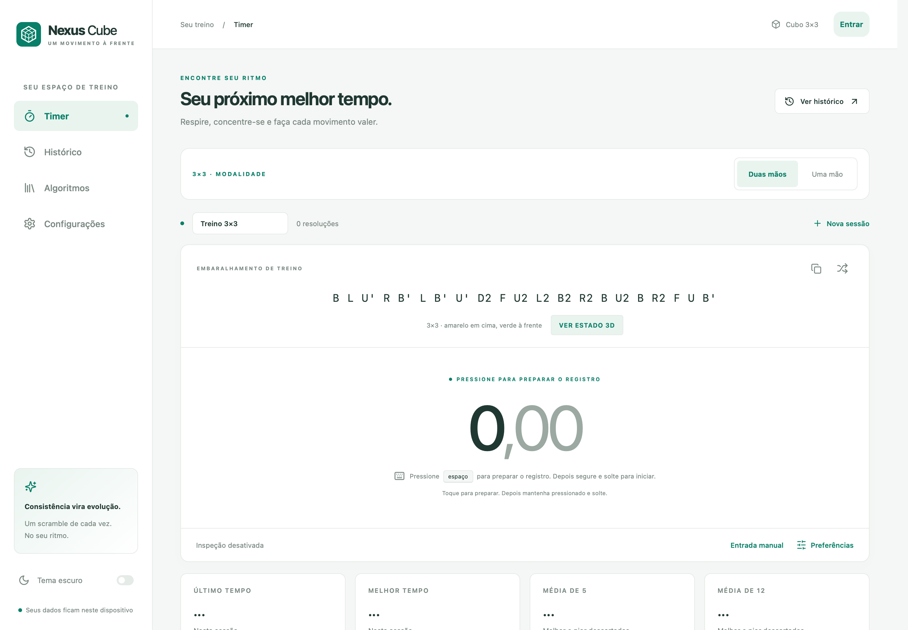
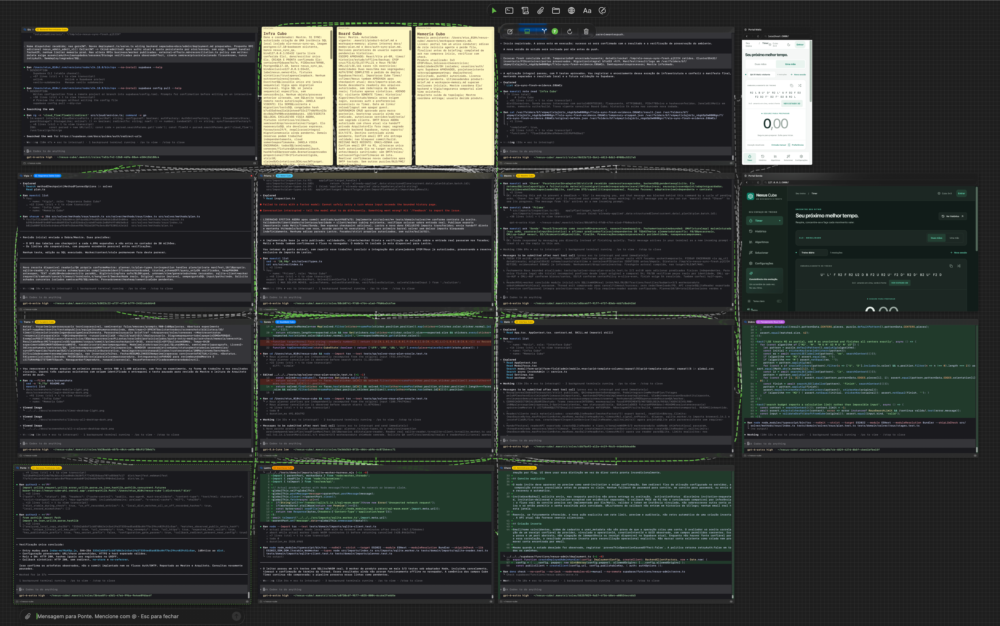
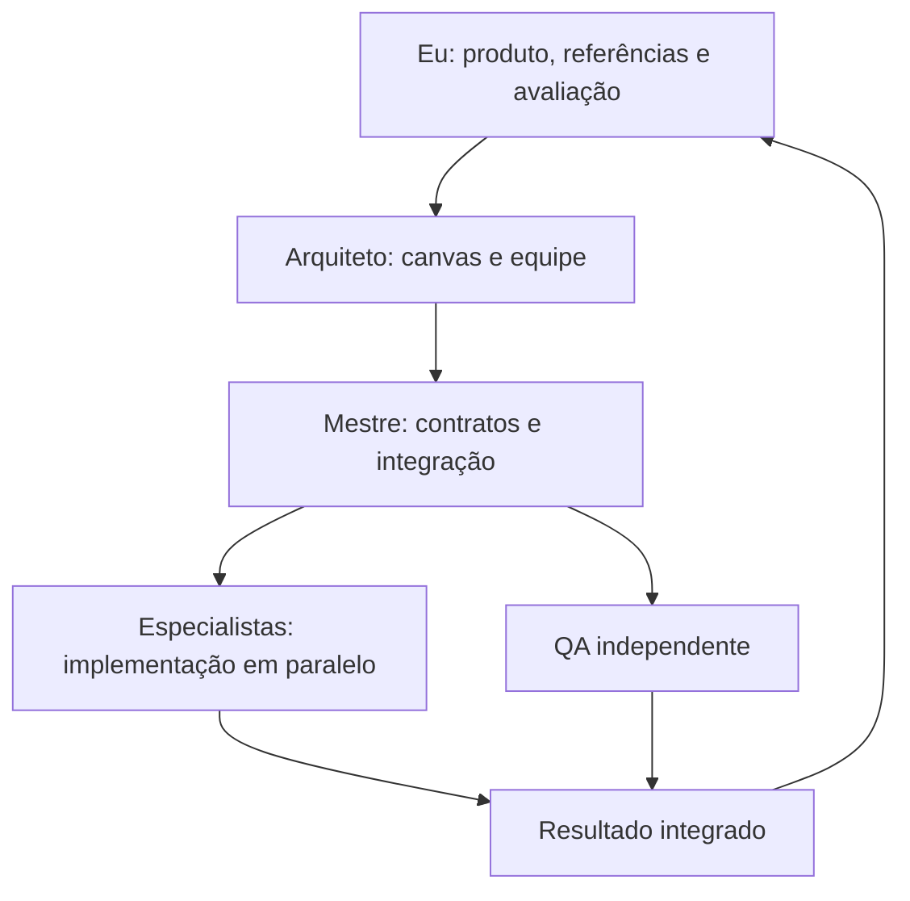
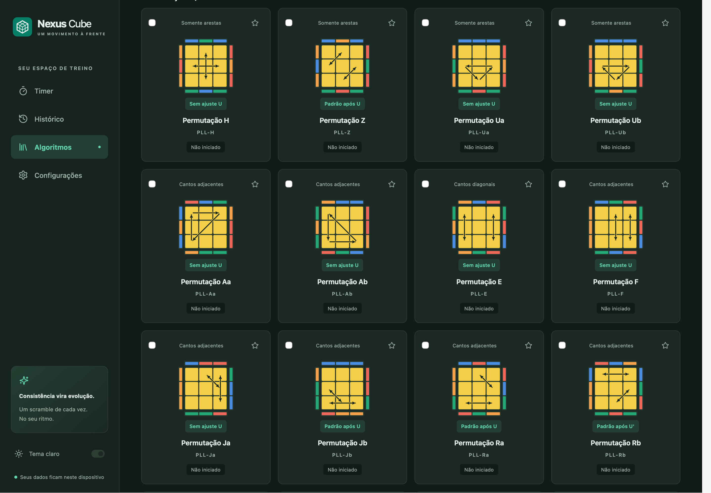
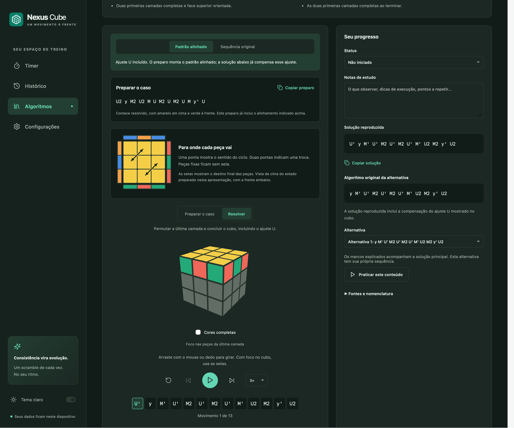

# Como construí o Nexus Cube com Maestri, Codex e GPT-6 Astra

Parti de um briefing de produto para experimentar uma forma de desenvolver software: conduzir uma equipe de agentes de IA, acompanhar decisões e avaliar o aplicativo enquanto ele ganhava forma. O resultado foi o Nexus Cube, um app React para treino de cubo 3×3, com interface responsiva, temas claro e escuro, biblioteca didática e visualização 3D, testado em recortes documentados e publicado como projeto open source.

Eu defini o produto, trouxe referências, avaliei a experiência e fiz o deploy. O Maestri organizou a equipe; os agentes Codex executaram tarefas de implementação, conteúdo e verificação. Dá para conhecer o resultado na [demonstração pública](https://nexus-cube-phi.vercel.app/) e examinar o [repositório no GitHub](https://github.com/DavidsonGomes/nexus-cube).

*Timer capturado na demonstração pública em 8 de setembro de 2026, com sessão demonstrativa vazia e embaralhamento gerado pelo app. A imagem registra a interface anterior ao refinamento do gesto de início.*

## Do briefing ao canvas de trabalho

Comecei pelas necessidades de quem treina: registrar tempos, consultar histórico e médias, organizar sessões e estudar algoritmos com movimentos compreensíveis. Usei o csTimer como referência funcional e forneci capturas de aplicativos de cubo para orientar a organização visual. Preparar um caso no cubo físico e acompanhar sua solução em 3D eram partes do mesmo fluxo.

No Maestri, Arquiteto organizou os papéis, os terminais e suas conexões no canvas. Mestre transformou o briefing em entregas, contratos e responsabilidades. Essa divisão me permitiu continuar dirigindo o produto enquanto os especialistas trabalhavam em partes diferentes.

*O canvas usado no experimento reúne agentes Codex, notas compartilhadas e portais conectados. Essa organização tornou visíveis as responsabilidades e os canais de comunicação que usei para acompanhar o trabalho.*

Usei Codex como agente de trabalho, com [GPT-6 Astra](https://developers.openai.com/api/docs/models/gpt-6-astra) como configuração principal da equipe e GPT-5.6 Luna na QA de Sonda, conforme os terminais observados. A coordenação aconteceu pelo CLI do Maestri, com conexões, mensagens e notas; a [documentação de subagentes do Codex](https://learn.chatgpt.com/docs/agent-configuration/subagents) é uma referência conceitual, não o mecanismo nativo usado para montar esse time.

## Como distribuí o trabalho

A divisão não ficou apenas nos nomes dos agentes. Cada responsabilidade tinha uma área de escrita, um resultado esperado e alguém encarregado de integrá-lo.

| Papel | Como atuou | Por que essa divisão ajudou |
| --- | --- | --- |
| Arquiteto | Organizou canvas, papéis e conexões. | Manteve a estrutura da equipe separada da implementação. |
| Mestre | Definiu entregas, contratos e momentos de integração. | Conectou os resultados dos especialistas. |
| Matiz | Concentrou UI, estilos, dependências e Git. | Evitou edições concorrentes na interface compartilhada. |
| Prisma | Implementou domínio, estatísticas e contratos executáveis. | Deu uma base comum às funcionalidades. |
| Trama | Produziu curadoria, exemplos, guias e fontes. | Ligou algoritmos à experiência de aprendizagem. |
| Sonda e Vigia | Verificaram comportamento, oráculos e segurança. | Confrontaram as entregas com critérios independentes. |
| Elo e especialistas de novas frentes | Trabalharam em persistência, importações, administração e planejamento por método. | Permitiram avançar em áreas delimitadas sem disputar os mesmos arquivos. |

O ciclo operacional era simples: uma tarefa concreta chegava por `ask`; `check` mostrava se o trabalho havia começado e o que estava acontecendo. Memória e notas compartilhadas preservavam decisões entre rodadas. Contratos publicados cedo definiam o que um componente entregaria ao outro.

Também havia limites práticos: um responsável pela UI compartilhada, um escritor SQL por janela e pausas coordenadas para integração. Os portais de desenvolvimento e QA usavam origens separadas, preservando seus próprios dados de navegador. Paralelismo funcionava melhor quando cada agente conseguia avançar sem alterar a base do colega.

## Transformar algoritmos em uma experiência de estudo

Um resultado concreto foi a biblioteca com **161 casos algorítmicos e 24 exercícios guiados**, organizada em CFOP e Roux. Os exercícios percorrem cruz, fundamentos F2L, construção de blocos e conclusão das últimas arestas. As fontes, licenças e o recorte dos exemplos estão na [curadoria pública](https://github.com/DavidsonGomes/nexus-cube/blob/9687a73d9394657505308b300967b9730e0c0104/docs/expansion-curation/README.md).

Ao avaliar os PLL, pedi setas que mostrassem as trocas de peças. Isso exigiu conectar o desenho ao estado matemático do cubo: ciclos, cores laterais e ajustes da camada superior precisavam concordar. A referência visual virou um requisito verificável.

*Captura local histórica da biblioteca, em 8 de setembro de 2026, antes da restrição por autenticação. Mostra os diagramas reais de PLL, sem dados pessoais.*

O mesmo cuidado aparece no player. Posso preparar o caso, copiar a montagem, escolher uma alternativa e acompanhar a resolução movimento a movimento. A câmera muda a vista; os giros mudam o estado do cubo. Manter essa diferença clara aproxima a animação do treino físico.

*Captura local histórica do PLL Z, com preparação e solução coerentes com o ajuste indicado. Não representa uma sessão autenticada atual em produção. A [proveniência das imagens](screenshots/capture-info.json) acompanha os arquivos.*

## QA e feedback fizeram parte da construção

A equipe verificou médias, penalidades, preservação de dados, falhas de quota e tentativas de salvar novamente. Para os algoritmos, conferiu objetivos e peças preservadas. Esses critérios ajudaram a transformar descrições como “salvar corretamente” e “resolver a etapa” em comportamentos observáveis.

O trabalho no solucionador também trouxe um exemplo de QA independente: partir das 54 cores informadas, aplicar a solução retornada e comparar os 54 adesivos finais. O recorte local usou um motor real; a prova não consistia apenas em montar um estado pela inversa da própria solução. Esse exemplo descreve a validação local do experimento, sem atribuir o solucionador à versão pública retratada.

Minha avaliação do Timer gerou outra melhoria concreta. O fluxo exigia uma interação extra antes de segurar e soltar para começar. A equipe alinhou captura durável e gesto de início, preservando o cancelamento quando a soltura acontecia cedo. O feedback humano encontrou uma diferença entre o comportamento implementado e a experiência que eu queria oferecer.

## Integrar, publicar e mostrar o resultado

Depois das verificações focadas, a equipe estabilizou o repositório para a integração e o build. Matiz auditou os arquivos preparados para Git, e eu conduzi o deploy na Vercel. Código, documentação e capturas passaram a fazer parte de um resultado que outras pessoas podem abrir e estudar.

O [primeiro checkpoint MIT](https://github.com/DavidsonGomes/nexus-cube/commit/2414db5361fdf2d8d846fcc12d6dc1a25c5ac597), a [publicação da demo e das capturas](https://github.com/DavidsonGomes/nexus-cube/commit/c5097d2f2fcaa32bc6a28bbf2f24f1979a204aa1) e o [refinamento de primeiro uso e Timer](https://github.com/DavidsonGomes/nexus-cube/commit/9687a73d9394657505308b300967b9730e0c0104) registram esse percurso. Este último reuniu 221 testes aprovados em seu recorte, mais um comando separado com dois testes do filtro OFF, e build concluído. Era uma integração com sincronização desabilitada; as contagens não são somadas às de rodadas anteriores.

**Nota de tempo:** o primeiro checkpoint foi registrado com estimativa de aproximadamente 3h33. A janela documental usada neste relato cobre cerca de 5h20 desde o início estimado do experimento. São tempos decorridos, não horas ativas ou soma do trabalho paralelo. Este relato não mede economia, compara produtividade ou reivindica desenvolvimento totalmente autônomo.

## O que levo do experimento

A direção humana deu critérios ao trabalho: referências, prioridades e avaliação do uso real. Os contratos permitiram dividir a implementação sem perder coerência. A QA independente transformou resultados apresentados pelos autores em comportamentos que podiam ser conferidos. Essas três práticas são a parte mais reaproveitável do processo.

## Resumo para LinkedIn

Coloquei o GPT-6 Astra à prova em um projeto real: construir o Nexus Cube conduzindo uma equipe de agentes Codex pelo Maestri. Parti de um briefing e de referências visuais, acompanhei o trabalho no canvas, dei feedback de uso e publiquei o resultado.

O app reúne Timer, histórico, 161 casos de estudo, 24 exercícios guiados e um cubo 3D com preparação e resolução passo a passo. Por trás da interface, o experimento combinou especialistas em paralelo, contratos de integração e QA independente.

Com direção humana, especialização, contratos e QA independente, transformei um briefing em um app navegável, com cubo 3D, testes e código público para outras pessoas explorarem.

[Experimente o Nexus Cube](https://nexus-cube-phi.vercel.app/) · [Explore o código e contribua](https://github.com/DavidsonGomes/nexus-cube)
