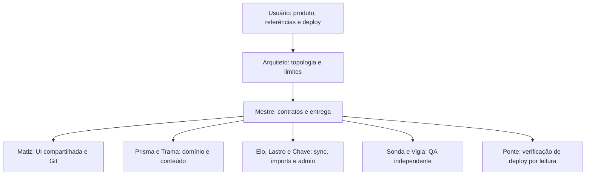

# Nexus Cube: um estudo de desenvolvimento com Maestri e Codex

**Corte documental:** 2026-09-08T17:59:36-03:00, fuso America/Sao_Paulo. **Tempo decorrido estimado:** 5h19min31s desde o início documental estimado de 2026-09-08T12:40:05-03:00. O primeiro checkpoint conserva sua estimativa histórica de **3h33**. Esses intervalos são de relógio, incluem coordenação e esperas e não representam horas ativas, soma do trabalho dos agentes ou conclusão do MVP ampliado.

O Nexus Cube é um aplicativo de treino de cubo 3×3 em português brasileiro. Este relato acompanha a construção do produto com agentes Codex coordenados pelo canvas e pelo CLI do Maestri, sob direção humana. No corte descrito, havia código público sob MIT, demonstração online e um checkpoint de melhorias de uso com sincronização desabilitada. Solucionador, sincronização automática, importações externas e administração continuavam em implementação ou validação.

O material serve de base para um futuro texto no LinkedIn. Sua elaboração não publica conteúdo em rede social. O [repositório público](https://github.com/DavidsonGomes/nexus-cube) permite examinar o código; os links de commits abaixo fixam as versões mencionadas, mesmo que a aplicação continue evoluindo.

## O objetivo mudou durante o trabalho

O pedido inicial combinava Timer, histórico, estatísticas, persistência local e estudo de OLL/PLL com um cubo 3D que executasse movimentos reais. A direção humana trouxe referências funcionais e visuais, examinou o resultado e ampliou o escopo: CFOP e Roux com percursos didáticos, modalidades Duas mãos e Uma mão, autenticação, sincronização, importação de outras plataformas e, depois, um solucionador a partir de 54 cores preenchidas manualmente.

A ampliação do solucionador para os três modos Direta, CFOP e Roux foi aprovada e está em implementação, sem declaração de disponibilidade dos novos modos didáticos.

Essa evolução exigiu rever contratos e prioridades. Uma lista de algoritmos CMLL não representa todo o Roux: blocos e últimas seis arestas precisam de objetivos e exemplos próprios. No corpus entregue, os 161 casos algorítmicos e 24 exercícios têm recortes declarados. Os exercícios percorrem cruz, fundamentos F2L, primeiro e segundo blocos e conclusão LSE; não enumeram todas as construções intuitivas possíveis. A autoria, as fontes, as licenças e as provas estão na [curadoria pública fixada no checkpoint](https://github.com/DavidsonGomes/nexus-cube/blob/9687a73d9394657505308b300967b9730e0c0104/docs/expansion-curation/README.md).

O usuário continuou responsável por definir produto, fornecer referências, repriorizar, aprovar ampliações e operar o deploy. Os agentes fizeram escolhas técnicas dentro das autorizações recebidas. Uma entrega intermediária publicada não cancelou requisitos posteriores nem virou, por conveniência, o aceite do produto inteiro.

## Maestri, Codex e modelo são camadas diferentes

O **Maestri** organizou o workspace: canvas, terminais, conexões, papéis, notas e comunicação pelo CLI. A orquestração observada utilizou `recruit`, `connect`, `ask`, `check` e notas. O **Codex** foi o agente de trabalho nas sessões, com instruções, ferramentas e acesso aos artefatos. **GPT-6 Astra** e **GPT-5.6 Luna** identificam os modelos configurados nos terminais observados.

A documentação oficial confirma o nome e o identificador `gpt-6-astra`, mas não comprova qual modelo executou uma chamada específica deste projeto. Essa distinção evita usar uma página de produto como evidência de execução. [GPT-6 Astra, documentação oficial da OpenAI](https://developers.openai.com/api/docs/models/gpt-6-astra).

Nesta rodada, Arquiteto conferiu os rodapés dos terminais por `maestri check`. Mestre, Matiz, Prisma, Elo, Vigia, Trama, Ponte, Lastro e Chave mostravam `gpt-6-astra high`; Sonda mostrava `gpt-5.6-luna low`. O crédito principal a GPT-6 Astra corresponde à configuração observada da equipe. A composição era mista. Essa leitura não é telemetria histórica completa nem auditoria da identidade interna de cada inferência.

A OpenAI também documenta subagentes especializados, configuração por papel e cuidado com conflitos entre escritas paralelas. É uma referência conceitual pertinente, porém a execução deste time foi coordenada pelo **CLI Maestri**, sem uso das ferramentas nativas `spawn_agent` para montar esta equipe. [Subagents, documentação oficial da OpenAI](https://learn.chatgpt.com/docs/agent-configuration/subagents).

## Quem decidia, quem escrevia e quem verificava

Arquiteto atuou como interface de coordenação e responsável pela topologia, pelas conexões e pelos limites operacionais. Mestre decompôs as entregas, negociou contratos e organizou as integrações. Esses coordenadores não receberam o crédito pela implementação dos especialistas.

Os nomes designam papéis dos agentes, não pessoas. A distribuição combinou responsabilidade funcional e propriedade de arquivos:

| Responsável | Fronteira de trabalho |
| --- | --- |
| Matiz | UI, estilos, configuração compartilhada, dependências, integração visual e operação de Git |
| Prisma | Estado matemático do cubo, estatísticas, contratos de domínio, migrações e motor do solucionador |
| Trama | Curadoria, exemplos didáticos, proveniência, licenças e guia do solucionador |
| Elo | Persistência por conta, sincronização, migrations e escrita SQL coordenada |
| Lastro | Importadores e validação dos formatos externos, após transferência explícita da reserva |
| Chave | Função e contratos de administração, sem assumir migrations ou escrita no banco |
| Sonda | QA independente de domínio e interface, com oráculos próprios |
| Vigia | Segurança, isolamento entre identidades, fronteiras de sync e revisão SQL |
| Ponte | Inspeção de artefatos públicos e configuração de deploy por leitura |

O compartilhamento do repositório tornava essas fronteiras necessárias. Abrir uma frente de importação não autorizava editar a UI de Matiz; criar administração não concedia a Chave a escrita SQL de Elo. As transferências de responsabilidade eram explícitas e preservavam os artefatos já produzidos.

## Como o paralelo foi executado

O ciclo começava com uma tarefa concreta enviada por `ask`: objetivo, arquivos permitidos, contrato esperado e evidência de encerramento. Em seguida, `check` permitia observar o terminal e confirmar início efetivo, em vez de tratar uma mensagem enviada como trabalho iniciado. A resposta trazia resultados, limites e arquivos estáveis. Quando necessário, hashes identificavam o estado entregue ao próximo consumidor.

Memória de workspace, notas de decisões e registros de infraestrutura mantinham as prioridades entre rodadas. Contratos publicados cedo definiam tipos, semântica, IDs, estados de erro e responsabilidade de integração. Esses registros sustentaram a execução, mas seu conteúdo privado não é reproduzido nem vinculado neste relato.

Havia três mecanismos para controlar concorrência:

1. **Reservas exclusivas de escrita.** Domínio, curadoria, imports, cloud e administração podiam avançar em paralelo. A UI compartilhada continuava com um único integrador.
2. **Um escritor SQL por janela.** A implementação e a revisão com execução no banco local eram sequenciais. A autorização local não implicava permissão para alterar o ambiente remoto.
3. **Pausas curtas para integração e Git.** Suíte completa e build exigiam repositório estável, consumidor único e liberação coordenada. A janela de Git incluía auditoria do índice antes de criar o commit. Com o commit imutável definido, as reservas independentes podiam retomar antes do push daquele commit. Uma inspeção no portal pausava somente a UI e suas dependências transitivas, sem exigir a parada de todo o repositório.

Os navegadores também tinham condutores definidos. Nesta execução, a interação visual ocorreu pelos portais Maestri, sem Playwright. Pausar interações deveria preservar o portal e os processos: uma pausa de QA não deveria destruir o ambiente que a próxima verificação precisaria observar.

## Verificação independente e limites das evidências

Para um cubo 3D, uma animação convincente não demonstra correção matemática. Aplicar um algoritmo ao estado construído pela sua própria inversa pode demonstrar consistência do motor, mas não confirma sozinho a identidade de um caso, seu nome convencional ou a preservação das peças exigidas pela etapa.

A curadoria CMLL foi confrontada com coordenadas independentes de permutação e orientação dos cantos, variações das arestas livres e preservação dos blocos. Os exercícios tiveram estados e objetivos examinados durante a sequência. Os testes também explicitam quando usam uma biblioteca de referência ou um estado derivado do próprio algoritmo: independência depende da origem do esperado. [Descrição pública dos testes e oráculos](https://github.com/DavidsonGomes/nexus-cube/blob/9687a73d9394657505308b300967b9730e0c0104/tests/qa/README.md).

O solucionador acrescentou outra fronteira. A entrada manual tem 54 adesivos, centros fixos e orientação declarada: amarelo acima, verde à frente e vermelho à direita. A QA construiu vetores de cores sem reutilizar o encoder ou o validador do produto, incluindo peças impossíveis, canto espelhado, orientação inválida e paridade. A solução retornada deve ser aplicada à **entrada original** e terminar nos 54 adesivos resolvidos. No corte deste documento, havia solução real validada em Node e aprovação no recorte do oráculo de 54 adesivos; o smoke local do modo Direta no editor/player foi concluído após repetição, pois a primeira tentativa com recarga não foi aceita. O worker real produziu 18 movimentos para as 54 cores do editor e terminou com os 54 adesivos resolvidos; player, layout mobile e cancelamento passaram nesse recorte. A identidade de autenticação era sintética. PWA offline, produção e encerramento do worker interno não foram comprovados.

Os textos para o usuário também fazem parte da correção. “Anterior” muda a visualização, mas a pessoa precisa desfazer o giro correspondente no cubo físico. “Reiniciar” volta ao estado informado na tela, sem restaurar fisicamente o cubo. O motor entrega uma solução geral, sem promessa de menor sequência nem de seguir CFOP ou Roux.

Cada evidência foi delimitada pelo ambiente observado:

| Evidência | O que permite afirmar | O que permanece fora dela |
| --- | --- | --- |
| Testes com fixtures e mocks | Comportamento sob entradas e falhas controladas | Autenticação real, entrega de email ou comunicação entre dispositivos |
| Persistência real em IndexedDB com identidade sintética | Comportamento local do armazenamento e das transições testadas | Identidade autenticada real no servidor |
| Motor real em Node e oráculo independente | Correção dos estados e soluções cobertos | Aceite completo de UI, worker no navegador e funcionamento offline |
| Banco PostgreSQL local com dados sintéticos | Semântica SQL e comportamento medido naquele ambiente | Aprovação do target remoto ou capacidade em produção |
| Recarga com transporte da origem indisponível | Recursos testados continuam disponíveis sob aquela falha simulada | Modo avião, instalação ou toque em dispositivo físico |
| Bundle público e hashes compatíveis | Correspondência dos artefatos inspecionados | SHA do deployment, todos os fluxos de Auth ou sync |

## Feedback e problemas que exigiram retrabalho

Os pontos abaixo foram consolidados a partir das verificações e retornos desta rodada. Os commits documentam as mudanças publicadas; os resultados locais em curso são relatos de execução com os limites indicados, sem links para logs privados.

| Situação concreta | Correção ou encaminhamento | Aprendizado |
| --- | --- | --- |
| O usuário pediu setas nos PLL porque as cores não bastavam para reconhecer as trocas | Diagramas passaram a representar ciclos de peças e ajuste U explícito, coerentes com preparação e alternativa | Feedback visual pode revelar uma exigência semântica, não apenas estética |
| A primeira interação do Timer só armava a captura; numa reprodução, soltar após 950 ms não iniciava | O gesto de segurar passou a iniciar a captura durável no mesmo gesto; soltura precoce cancela o início | O caminho feliz do teste precisa corresponder ao gesto que a pessoa realmente faz |
| Criar ou selecionar treino bloqueava o primeiro uso | Um espaço visitante comprovadamente novo passou a receber uma sessão inicial visível, preservando sessões existentes e modalidades desconhecidas | Conveniência inicial não autoriza reclassificar histórico |
| Após cadastro com sessão válida, o modal permanecia aberto e apresentava “Sair” | O fluxo foi ajustado para encerrar o modal após autenticação válida e retornar à área solicitada | A existência de uma sessão correta não garante que a interface comunique seu estado |
| O primeiro bundle de produção inicializava cloud com strings vazias de URL e chave pública | O usuário corrigiu as variáveis de Production e fez redeploy; o novo artefato foi inspecionado | Era configuração de build/deploy, não evidência de falha SMTP |
| Testes legados ainda refletiam schema e expectativas anteriores | Foram revistos para schema 3, modalidades, escopos e resultados esperados independentes | Testes verdes iniciais não demonstravam necessariamente o que seus títulos prometiam |
| Sync apresentou confirmação histórica de envio, falso estado “sincronizado”, prévia antes da hidratação e sensibilidade à ordem de chaves JSON | Houve correções e revalidações focadas em ambiente controlado | Aprovação local de correções não equivale a aceite global de sync ON |
| O staging SQL apresentou lentidão em uma entrada de 200 KiB | As execuções locais desse foco registraram 66,7 s originalmente, 444,8 ms na primeira repetição após otimização e 2,33 s na última. O autor reportou 9/9 testes SQL em PostgreSQL 17.10; a janela independente de Vigia estava em curso, sem aceite concluído | Há variação entre execuções locais; esses números não representam benchmark controlado, latência garantida, capacidade máxima ou resultado no servidor remoto |

O checkpoint que reuniu melhorias do primeiro uso, Timer e interface de conta manteve a sincronização desligada. A decisão permitiu publicar um recorte verificável enquanto o restante continuava em desenvolvimento. [Mudanças de UX com sync OFF](https://github.com/DavidsonGomes/nexus-cube/commit/9687a73d9394657505308b300967b9730e0c0104).

## Marcos públicos e tempo decorrido

As datas abaixo são os horários de commit com fuso; não devem ser confundidas com horário comprovado de deploy ou conclusão de todos os testes.

| Marco | Horário do commit | Evidência e recorte |
| --- | --- | --- |
| [2414db5, primeiro checkpoint MIT](https://github.com/DavidsonGomes/nexus-cube/commit/2414db5361fdf2d8d846fcc12d6dc1a25c5ac597) | 2026-09-08T16:15:35-03:00 | 153 arquivos; 156/156 testes no recorte integrado e build com exit 0; limites de UI e Auth real declarados |
| [c5097d2, demo e documentação visual](https://github.com/DavidsonGomes/nexus-cube/commit/c5097d2f2fcaa32bc6a28bbf2f24f1979a204aa1) | 2026-09-08T16:29:55-03:00 | README, demonstração e oito PNGs; sem alteração de runtime |
| [9687a73, UX com sync OFF](https://github.com/DavidsonGomes/nexus-cube/commit/9687a73d9394657505308b300967b9730e0c0104) | 2026-09-08T17:35:32-03:00 | 50 arquivos; 47 arquivos de testes, 221 aprovações e outro comando com 2/2 do filtro OFF; build com exit 0 e 31 arquivos em dist; quatro capturas locais históricas da biblioteca |

**156 e 221 são recortes de rodadas diferentes e não devem ser somados como testes únicos.** O comando OFF de 2/2 também tem escopo próprio. Cenários ON excluídos, inclusive uma falha conhecida, permaneceram fora do aceite. Quantidade de testes não é benchmark de qualidade ou produtividade. O [README daquele checkpoint](https://github.com/DavidsonGomes/nexus-cube/blob/9687a73d9394657505308b300967b9730e0c0104/README.md) registra o manifesto e suas exclusões.

O início adotado, `2026-09-08T12:40:05-03:00`, é uma estimativa baseada no primeiro registro documental. A diferença até o corte deste texto, `2026-09-08T17:59:36-03:00`, é **5h19min31s**. A anotação histórica de **3h33 até o primeiro checkpoint** permanece como foi reportada; não é uma duração exata recalculada a partir do horário do commit. Registrar segundos no corte permite reproduzir a subtração, sem tornar exata a estimativa da origem.

Não foram consolidados custos, consumo de tokens, horas ativas por agente ou uma execução de controle com outra equipe. Portanto, o caso não sustenta comparação quantitativa de produtividade, economia financeira ou superioridade entre modelos.

## O que estava publicado e o que continuava aberto

O checkpoint público incluía o núcleo de treino, o corpus didático e as melhorias de UX com **sync OFF**. A inspeção por leitura da demonstração encontrou artefatos compatíveis com o build aprovado. O SHA do deployment não estava disponível nessa evidência. O usuário relatou cadastro e conexão bem-sucedidos; esse relato não substitui uma suíte independente dos fluxos reais de autenticação, recuperação ou email.

| Frente | Estado no corte documental |
| --- | --- |
| Guia do solucionador | Três documentos autorais entregues, com orientação, mensagens, notação e fontes |
| Solucionador 54 cores | Validação e solução real em Node verificadas; oráculo independente aprovado em seu recorte; smoke local do modo Direta em editor/player, mobile e cancelamento concluído após repetição, com worker real e autenticação sintética; sem prova de PWA offline, produção ou encerramento do worker interno, nem aceite integrado final |
| Sincronização automática | Implementação, correções focadas e SQL local em andamento; produto publicado permanece OFF; aceite remoto e entre dispositivos pendente |
| Importações externas | Parsers existentes e integração em evolução; aplicação transacional no fluxo V4 ainda não entregue como ponta a ponta |
| Administração | Serviço em implementação, ainda sem integração final de interface; sem inferir identidade de administrador inicial ou aprovação remota |
| QA ampliada | Fluxos reais, navegador/offline e integrações seguintes ainda exigem evidências próprias |

Código presente, teste focado aprovado, comportamento observado no navegador e recurso publicado são marcos distintos. Manter essas diferenças visíveis foi parte da entrega.

## Lições e roteiro repetível

A experiência destacou o valor de tarefas pequenas o suficiente para terem dono e evidência de conclusão. Também mostrou o custo de interfaces compartilhadas, testes desatualizados e suposições sobre ambientes. Acrescentar agentes exige contratos e integração; a quantidade de terminais, isoladamente, não descreve progresso.

Um roteiro aproveitável em outro projeto é:

1. Registrar objetivo, critérios de aceite e decisões que só o usuário pode tomar.
2. Dividir responsabilidades com reservas concretas de arquivos e um integrador para áreas compartilhadas.
3. Publicar contratos mínimos executáveis antes de conectar implementações paralelas.
4. Enviar tarefas delimitadas e verificar início efetivo; recolher artefato, evidência e lacunas ao encerrar.
5. Reservar QA independente, com resultados esperados que não apenas repitam a implementação.
6. Separar mocks, testes locais reais, navegador, produção e dispositivo físico nos relatórios.
7. Serializar escrita SQL e realizar pausas de integração somente pelo tempo necessário para um estado estável.
8. Publicar checkpoints auditados, fontes e limitações, preservando os requisitos ainda abertos.
9. Transformar feedback humano em novos critérios verificáveis e reabrir as reservas correspondentes.

## Resumo para adaptar ao LinkedIn

O Nexus Cube começou como um app de Timer e estudo de cubo 3×3. A direção humana ampliou o produto, trouxe referências e apontou problemas concretos no reconhecimento dos PLL, no primeiro uso e no gesto do Timer.

A implementação foi dividida entre agentes Codex coordenados pelo canvas e CLI do Maestri. A configuração observada tinha GPT-6 Astra na maior parte da equipe e GPT-5.6 Luna na QA de Sonda. Contratos, responsáveis exclusivos por arquivos e verificações independentes sustentaram o trabalho em paralelo.

Houve retrabalho: configuração vazia no bundle de produção, testes legados que precisavam de revisão e falhas de sync e SQL encontradas em ambientes controlados. O primeiro checkpoint ficou registrado com estimativa histórica de 3h33; até o corte deste estudo, passaram-se aproximadamente 5h20 desde o início documental estimado. É tempo de relógio, sem comparação de produtividade e sem alegação de MVP completo.

O código e os checkpoints estão públicos. As melhorias de UX foram publicadas com sync OFF; solucionador, sincronização, importações e administração seguiam em implementação ou validação. O aprendizado central foi tornar explícito quem decide, quem escreve e qual evidência permite avançar.

[Conheça o repositório e os marcos do Nexus Cube](https://github.com/DavidsonGomes/nexus-cube).
